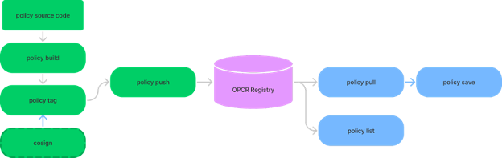

The _Open Policy Agent _([OPA](https://www.openpolicyagent.org/)) is a general-purpose decision engine used in a wide variety of contexts where policies govern authorization and access-control. One of the most important value propositions of OPA is that it decouples decision logic (defined in the policy) from decision enforcement (which happens in the application or service). This decoupling allows the policy to be developed and managed separately from the application or service. Decision-making execution is delegated to the OPA engine, guaranteeing that the policies are consistently interpreted and enforced. 

OPA is used to enforce policies in many contexts, including microservices, Kubernetes, CI/CD pipelines, and API gateways. Having a single engine and language for handling authorization policies across the stack is a huge advantage for developers: it allows for policy reuse and makes testing, automation, and maintenance easier.

OPA policies are written in Rego and then bundled into a compressed tarball. The tarball is then loaded into the target environment, where the policy is enforced.

We believe that OPA’s distribution workflow could be enhanced and improved by integrating it with two Linux Foundation OSS projects: [OCIv2](https://opencontainers.org/) - the industry standard for container image formats, and [Sigstore](https://www.sigstore.dev/), an open and pluggable standard for code signing.   

Three interconnected concerns need to be addressed as part of the policy-as-code workflow: versioning, signing, and sharing. 

* Versioning a policy makes it easier to maintain, share and discover
* Signing a policy makes it possible to trust that the policy’s content is what the consumer of the policy expects it to be
* Sharing and discoverability of policies promote reuse and reduce duplication of code and effort. 

<!--truncate-->

## Leveraging the docker workflow and standards

Currently, there’s no prescribed mechanism or convention for versioning OPA bundles. You could come up with your own naming convention. You could also version the bundle by adding the version information in its manifest file. Using a naming convention is helpful but can’t be standardized or enforced. Leveraging the manifest file within the policy bundle means that whenever you try to resolve what version has been deployed or is currently running, you have to crack open the tarball to retrieve the version information. 

That’s where the OCIv2 standard comes in: by wrapping policy bundles with an OCI container, we can add a layer of metadata, including version information and tags. So now, our policy images can be indexed and searched without requiring extracting the bundle's content. With searchable indexes, policy images become easily discoverable and shareable. 

The OCI wrapper provides us with an _immutable_ artifact, further increasing our confidence that we precisely know what we’re running or deploying. In addition, using an OCI wrapper means we can effectively utilize the `cosign` signing tool by Sigstore, an open-source project _dedicated _to code signing. The advantages of using an industry-standard solution over a home-grown, custom solution are clear. Given that OPA’s mission doesn’t revolve around signing, we think using Sigstore for this purpose makes a lot of sense. 

Using the OCI standards allows us to leverage a well-established workflow - the same one developers know and love using Docker. 



The process follows the familiar build -> tag -> push -> pull pattern. When needed, we can use `cosign` to sign the policy image. 

The policy CLI works with the [Open Container Registry](https://opcr.io) (OPCR) which is similar to Docker Hub: it lets developers freely host policy images, search through these shared policies and download them as they would with other container registries. 

## The `policy` CLI

Using the `policy` CLI is very similar to using the Docker CLI. Here are some examples:

### Building images

```
$ policy build . -t omrigazitt1/peoplefinder:1.0.0

Created new image.digest: sha256:84dbd4e3b5572dd2f23c3c987c89443fdcb57af87d714ea296fc552192fb17e9
Tagging image.reference: omrigazitt1/peoplefinder:1.0.0
```

### Tagging images

```
$ policy tag omrigazitt1/peoplefinder:1.0.0 omrigazitt1/peoplefinder:latest
Tagging image.reference: omrigazitt1/peoplefinder:latest
```

### Pushing images

```
$ policy push omrigazitt1/peoplefinder:1.0.0
Resolved ref [opcr.io/omrigazitt1/peoplefinder:1.0.0].digest: sha256:84dbd4e3b5572dd2f23c3c987c89443fdcb57af87d714ea296fc552192fb17e9
Pushed ref [opcr.io/omrigazitt1/peoplefinder:1.0.0].digest: sha256:05e6ed84d86f6a252e24f33cb12138d9193780f1d89a1b2ff14ced315fdf8481
```

### Signing images

```
$ cosign sign --key cosign.key opcr.io/omrigazitt1/peoplefinder:1.0.0
Enter password for private key: Pushing signature to: opcr.io/omrigazitt1/peoplefinder:sha256-05e6ed84d86f6a252e24f33cb12138d9193780f1d89a1b2ff14ced315fdf8481.sig
```

### Pulling images

```
$ policy pull omrigazitt1/peoplefinder:1.0.0
Pulling.ref: omrigazitt1/peoplefinder:1.0.0
Pulled ref [opcr.io/omrigazitt1/peoplefinder:1.0.0].digest: sha256:84dbd4e3b5572dd2f23c3c987c89443fdcb57af87d714ea296fc552192fb17e9
```

### Exporting images

```
$ policy save omrigazitt1/peoplefinder
Resolved ref [opcr.io/omrigazitt1/peoplefinder:1.0.0].digest: sha256:84dbd4e3b5572dd2f23c3c987c89443fdcb57af87d714ea296fc552192fb17e9
```

### Listing images

```
$ policy images
|        REPOSITORY        |  TAG  | SIZE  |  CREATED AT  |
|--------------------------|-------|-------|--------------|
| omrigazitt1/peoplefinder | 1.0.0 | 555 B | 1 minute ago |

$ policy images --remote
|        REPOSITORY        |  TAG  | 
|--------------------------|-------|
| omrigazitt1/peoplefinder | 1.0.0 | 
```

## Summary

We created OPCR because we believe OPA policies should be easy to share, and we think that OCIv2 is the best standard for that purpose. Leveraging OCIv2 allows us to use other tools in the ecosystem, which improves the overall development workflow as well as the distribution process.

We hope you find this tool useful!


